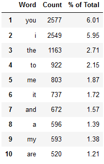
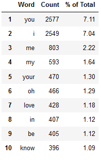
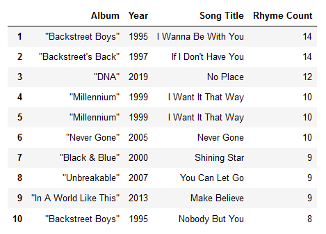
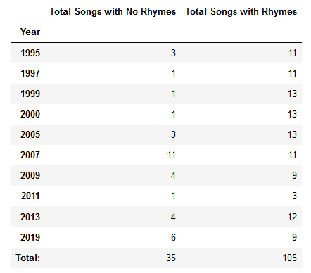
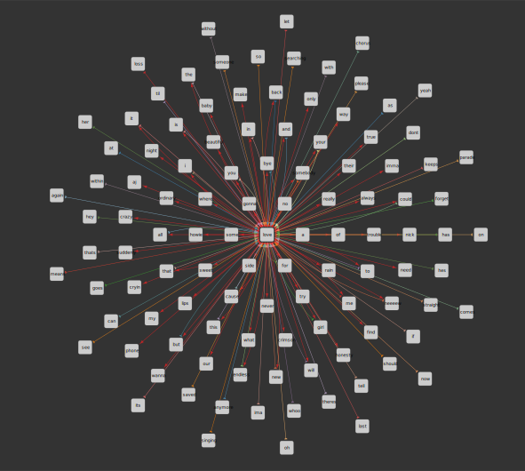

# Nostalgic Song Analysis

A short analysis on a boy band from the 90s and generating lyrics from their lyrics.

## Setup

The Python packages used in the project are in `requirements.txt`. Download them via **pip** using the command

```
pip install -r requirements.txt
```

**Collecting The Data: A Lyrics Scraper**

The data source `lyrics_data_master.csv` was created by running the lyrics scraper [bsblyricscraper.py](bsblyricscraper.py) which is a web scraper coded to extract data on Backstreet Boys albums from the website [AZLyrics](https://www.azlyrics.com/). The code uses delayed requests (between 1-60 second intervals) to avoid getting blocked before some data can be extracted.

## Song Analyser

The `songAnalyser.py` reads in the data from `lyrics_data_master.csv` and does a basic analysis of the lyrics. The same program in a Jupyter notebook style is []()

### Word Count

**Top 10 Word Count**



Words such as a, the, and, from, to, it, that, thats, or, this, of, is, are, am, these are not meaningful and so we can remove them to get a better idea of what are top 10 words used:

**Top 10 Word Count (filtered)**



### Rhyme Count
**Top 5 Songs With Most Rhymes**



**Total Number of Songs with Rhymes per Year**



### Generated Lyrics

New lyrics are generated by using similar technique to Markov Chains. A unique number of words and the probability of its _followers_ is created and used for to generate a string. There is a total of 2111 unique words with followers. The code also creates and adjacency matrix which we visualised using a free software called Cytoscape. As a result, the graph has 2111 nodes and 12977 edges:


If we focus on one of the top words _love_, and only consider those nodes that are connected to it, then we get a simpler graph:




The following song title and lyrics were generated by the code:

	Breathing My Let
	----------------
	
	Worth it no stronger than you remember those tear us to see
	My side
	Nobody but i had it in love me starts fillin' up all of you, i'm gonna have finished
	Baby,
	And kevin:]
	That's barely breathing
	That we never let go
	That i just when you go
	Ain't nothin' but now i’m falling apart
	Yeah
	I'll keep coming up from the chateau
	We never make you are you knew you back right
	So, don't ever take it makes you don't wanna share you hands on y'all

	(you know, i never make alone)
	Roll with you can't let it all the party at
	It's killing me show me it's now i was
	Took you to make you through all of affection
	[spoken:]
	All a time to tremble
	My life
	Cause i be afraid, don't want you shut me
	[chorus]
	And fight until she can make it all around,
	all a raining day you'll always say goodbye to you know that it's getting closer, closer
	No one like a first time in my heart, you're bigger
	All about
	More
	Just me? is for you back
	[nick, howie:] can't believe, you are
	You're under the shower, at the space
	Not my

	So please
	[chorus:]

	Just let go and me
	Don't wanna be (i want doesn't matter anyway)
	Cuz
